# 🤖 Epok — Autonomous Multi-Agent Feature Delivery & Self-Healing Review Swarm

> An enterprise-grade, event-driven multi-agent orchestration platform that autonomously converts Linear tickets into production-grade Pull Requests on GitHub, gated by interactive Slack human reviews and self-healing CI feedback loops.

---

## 📐 Architecture & System Overview

Epok connects issue tracking, LLM-driven software engineering, human-in-the-loop governance, and continuous integration into a resilient, stateful workflow powered by **Temporal.io** and **Google Gemini 2.5 Flash**.

```mermaid
flowchart TD
    subgraph Webhook Gateway
        L[Linear Issue Webhook] -->|POST /webhooks/linear| G[FastAPI Webhook Gateway]
        GH[GitHub Actions CI Webhook] -->|POST /webhooks/github| G
        S[Slack Button Actions Webhook] -->|POST /webhooks/slack| G
    end

    subgraph Temporal Workflow Engine
        G -->|Start Workflow| W[FeatureDeliveryLifecycleWorkflow]
        
        subgraph Agent 1: Spec & Architecture Agent
            W -->|Activity: Ingest Issue| L_ACT[fetch_linear_issue_details]
            W -->|Activity: Inspect Tree| GH_ACT1[inspect_repo_context]
            W -->|Activity: Gemini 2.5 Flash| GEM_ACT1[generate_technical_spec]
        end
        
        subgraph Human Approval Gate
            W -->|Activity: Dispatch Slack UI| SLACK_ACT1[dispatch_slack_spec_approval]
            SLACK_ACT1 -->|Post Block Kit Card| SLACK_CH[Slack #epok-approvals]
            SLACK_CH -->|Human Clicks Approve| S
            S -->|Signal: spec_approval_signal| W
        end

        subgraph Agent 2: Code Generation & PR Swarm
            W -->|Activity: Code Generation| GEM_ACT2[generate_code_patches]
            W -->|Activity: Git Branch Commit| GH_ACT2[commit_code_patches]
            W -->|Activity: Open GitHub PR| GH_ACT3[create_github_pr]
        end

        subgraph Agent 3: CI Watchdog & Self-Healing Loop
            GH -->|CI Failure| CI_WF[CIRepairWorkflow]
            CI_WF -->|Activity: Extract Failure Logs| CI_ACT1[fetch_ci_failure_logs]
            CI_WF -->|Activity: Gemini Repair Patch| CI_ACT2[generate_ci_repair_patches]
            CI_WF -->|Activity: Commit Fix Patch| GH_ACT2
        end

        subgraph Real-Time Lifecycle Sync
            W -->|Activity: Sync State & Comment| L_SYNC[update_linear_issue_status]
            W -->|Activity: Update Card| S_SYNC[update_slack_spec_status]
        end
    end
```



---

## ✨ Key Features

### 1. 🧠 Agent 1: Technical Architecture Spec Agent
* **Context Extraction**: Queries Linear GraphQL API for ticket descriptions, requirements, and user stories.
* **Codebase Tree Inspection**: Traverses repository structures, dependency manifests (`pyproject.toml`, `package.json`), and entrypoints via `PyGithub`.
* **Structured Spec Generation**: Enforces `SpecArchitectureOutput` Pydantic schemas using Gemini 2.5 Flash to generate executive summaries, impacted file lists, step-by-step implementation plans, and unit test strategies.

### 2. 🚦 Interactive Slack Human-in-the-Loop Gate
* **Interactive Block Kit UI**: Renders rich Slack cards with executive summaries, impacted file badges, Linear links, and interactive **Approve Spec** / **Request Revision** action buttons.
* **Resilient Temporal Gate**: Pauses workflow execution for human input using `workflow.wait_condition` with a **48-hour SLA timeout**.

### 3. 🛠️ Agent 2: Code Generation & PR Swarm
* **Multi-File Patch Generation**: Gemini 2.5 Flash generates complete, drop-in replacement source code for all target files.
* **Automated Feature Branching**: Creates `epok/<issue-id>` feature branches and commits updated files using PyGithub.
* **Pull Request Submission**: Opens Pull Requests targeting `main` with formatted markdown summaries and returns typed `CodePatchResult` objects.

### 4. 🔄 Agent 3: CI Watchdog & Self-Healing Feedback Loop
* **Workflow Run Webhook Receiver**: Ingests GitHub Actions `workflow_run.completed` events.
* **Failure Log Extraction**: Downloads build logs, parses step-level failures, and isolates stack traces (`fetch_ci_failure_logs`).
* **Iterative Repair Loop**: Runs up to **3 automated repair iterations**, prompting Gemini to analyze failure traces, generate fix patches, and push commits to the PR branch (`CIRepairWorkflow`).

### 5. 🌐 Master Orchestration & Lifecycle Sync
* **Top-Level Orchestrator**: `FeatureDeliveryLifecycleWorkflow` manages end-to-end execution.
* **Linear Synchronization**: Updates Linear issue status (`In Progress` → `In Review` → `Done`) and posts automated progress comments with PR links (`update_linear_issue_status`).
* **Slack Card Updates**: Updates original Slack cards dynamically in real-time (`update_slack_spec_status`).

---

## 🧰 Tech Stack & Dependencies

* **Language**: Python 3.9+
* **Orchestration**: Temporal.io Python SDK (`temporalio`)
* **API Gateway**: FastAPI & Uvicorn
* **AI Engine**: Google Gemini 2.5 Flash (`google-genai` SDK)
* **Integrations**: PyGithub, Slack Webhooks (`httpx`), Linear GraphQL API
* **Data Validation**: Pydantic v2
* **Containerization**: Docker (multi-stage `python:3.9-slim`)
* **Infrastructure**: Terraform IaC for GCP Cloud Run, Cloud SQL PostgreSQL, and Secret Manager

---

## 📁 Repository Structure

```
epok/
├── Dockerfile                  # Multi-stage production Docker image
├── .dockerignore               # Docker build ignore file
├── pyproject.toml              # Project dependencies & package config
├── docker-compose.yml          # Local sandbox (Postgres, Temporal Server, Temporal UI)
├── main.py                     # FastAPI Webhook Gateway entrypoint
├── scripts/
│   └── start.sh                # Container entrypoint (MODE=api or MODE=worker)
├── src/
│   ├── api/
│   │   └── routes/             # Webhook route handlers
│   │       ├── linear.py       # Linear webhook ingestion
│   │       ├── github.py       # GitHub Actions webhook ingestion
│   │       └── slack.py        # Slack interactive button handler
│   ├── activities/             # Temporal activity implementations
│   │   ├── linear_activities.py# Linear issue fetching & GraphQL status sync
│   │   ├── github_activities.py# GitHub repo context, commit & PR activities
│   │   ├── gemini_activities.py# Gemini architecture spec generator
│   │   ├── slack_activities.py # Slack Block Kit dispatch & card update
│   │   ├── code_activities.py  # Gemini code patch generator
│   │   └── ci_activities.py    # CI log extractor & self-healing patch activity
│   ├── workflows/              # Temporal workflow definitions
│   │   ├── spec_architecture.py# Spec Architecture Workflow (Agent 1)
│   │   ├── code_generation.py  # Code Generation Workflow (Agent 2)
│   │   ├── ci_repair.py        # Self-Healing Repair Workflow (Agent 3)
│   │   └── feature_delivery.py # Master Feature Delivery Workflow
│   ├── models/                 # Pydantic DTOs & event schemas
│   │   ├── dtos.py             # Data Transfer Objects
│   │   └── events.py           # Webhook payload models
│   └── worker/
│       └── worker.py           # Temporal Worker runner process
├── terraform/                  # Infrastructure-as-Code for GCP
│   ├── main.tf                 # Cloud Run, Cloud SQL & Secret Manager resources
│   ├── variables.tf            # Terraform variables
│   ├── outputs.tf              # Webhook URLs & resource outputs
│   └── terraform.tfvars.example# Example Terraform configuration
├── test/                       # Comprehensive unit test suite
│   ├── test_activities.py      # Activity unit tests
│   ├── test_dtos.py            # DTO validation tests
│   ├── test_webhooks.py        # Webhook API tests
│   ├── test_worker.py          # Temporal Worker registration tests
│   └── test_workflows.py       # Temporal Workflow execution tests
└── docs/
    └── e2e_runbook.md          # Operational manual & deployment guide
```

---

## ⚡ Quick Start & Local Development

### 1. Prerequisites
Ensure you have installed:
* Python 3.9+
* Docker & Docker Compose
* Git

### 2. Clone & Setup Environment
```bash
git clone https://github.com/anonymousagar/epok.git
cd epok

python3 -m venv .venv
source .venv/bin/activate
pip install -e .
```

### 3. Launch Local Services (Temporal & Postgres)
```bash
docker-compose up -d
```
* **Temporal Web UI**: [http://localhost:8233](http://localhost:8233)
* **PostgreSQL Database**: `localhost:5432`

### 4. Configure API Keys (`.env`)
Export the required API keys and secrets:
```bash
export GEMINI_API_KEY="AIzaSy..."
export GITHUB_TOKEN="ghp_..."
export SLACK_BOT_TOKEN="xoxb-..."
export LINEAR_API_KEY="lin_api_..."
export LINEAR_WEBHOOK_SECRET="secret_linear"
export GITHUB_WEBHOOK_SECRET="secret_github"
export SLACK_SIGNING_SECRET="secret_slack"
export TEMPORAL_HOST="localhost:7233"
export EPOK_TASK_QUEUE="epok-task-queue"
```

### 5. Launch Worker & Webhook Gateway
In terminal 1 (Worker):
```bash
python src/worker/worker.py
```

In terminal 2 (API Gateway):
```bash
uvicorn main:app --host 0.0.0.0 --port 8080 --reload
```

---

## 🧪 Testing

Run the full automated pytest suite:
```bash
.venv/bin/pytest test/test_activities.py test/test_dtos.py test/test_webhooks.py test/test_worker.py test/test_workflows.py
```
> **Result**: `39 passed in 6.46s`

---

## ☁️ GCP Production Deployment

### 1. Build & Push Container Image
```bash
docker build -t gcr.io/<YOUR_GCP_PROJECT>/epok-app:latest .
docker push gcr.io/<YOUR_GCP_PROJECT>/epok-app:latest
```

### 2. Provision GCP Infrastructure via Terraform
```bash
cd terraform
cp terraform.tfvars.example terraform.tfvars
# Update GCP Project ID and secret values
terraform init
terraform apply
```

### 3. Configure Webhooks
Point your external platforms to your deployed Cloud Run URL:

| Webhook Event | Endpoint URL |
| :--- | :--- |
| **Linear Issue Event** | `https://<CLOUD_RUN_URL>/webhooks/linear` |
| **GitHub Actions Run** | `https://<CLOUD_RUN_URL>/webhooks/github` |
| **Slack Button Click** | `https://<CLOUD_RUN_URL>/webhooks/slack` |

For step-by-step verification, see the complete [E2E Runbook](file:///Users/atul.sagar/epok/docs/e2e_runbook.md).

---

## 🛡️ Design Decisions & Tradeoffs

1. **Temporal.io Orchestration**: Replaced fragile, custom queue workers with Temporal workflows to guarantee state persistence, exponential retry policies, and long-running human approval SLA gates.
2. **Pydantic Schema Enforcement with Gemini 2.5 Flash**: Enforced strict response schemas (`CodePatchesOutput`, `SpecArchitectureOutput`) using Gemini's structured output API (`response_mime_type="application/json"`) to eliminate malformed LLM responses.
3. **Bounded Repair Iterations**: Bounded the self-healing repair loop in `CIRepairWorkflow` to a maximum of **3 iterations** to prevent infinite loops and runaway API costs.

---

## 📄 License
This project is licensed under the MIT License.

