# 🤖 Epok — Autonomous Multi-Agent Feature Delivery & Self-Healing Review Swarm

> An enterprise-grade, event-driven multi-agent orchestration platform that autonomously converts Linear tickets into production-grade Pull Requests on GitHub, gated by interactive Slack human reviews and self-healing CI feedback loops.

---

## 📐 Architecture & System Overview

Epok connects issue tracking, LLM-driven software engineering, human-in-the-loop governance, and continuous integration into a resilient, stateful workflow powered by **Temporal.io** and **Google Gemini 2.5 Flash**.

```mermaid
flowchart TD
    subgraph Webhook Gateway
        L[Linear Issue Webhook] -->|POST /webhooks/linear| G[FastAPI Webhook Gateway]
        GH[GitHub Actions CI Webhook] -->|POST /webhooks/github| G
        S[Slack Button Actions Webhook] -->|POST /webhooks/slack| G
    end

    subgraph Temporal Workflow Engine
        G -->|Start Workflow| W[FeatureDeliveryLifecycleWorkflow]
        
        subgraph Agent 1: Spec & Architecture Agent
            W -->|Activity: Ingest Issue| L_ACT[fetch_linear_issue_details]
            W -->|Activity: Inspect Tree| GH_ACT1[inspect_repo_context]
            W -->|Activity: Gemini 2.5 Flash| GEM_ACT1[generate_technical_spec]
        end
        
        subgraph Human Approval Gate
            W -->|Activity: Dispatch Slack UI| SLACK_ACT1[dispatch_slack_spec_approval]
            SLACK_ACT1 -->|Post Block Kit Card| SLACK_CH[Slack #epok-approvals]
            SLACK_CH -->|Human Clicks Approve| S
            S -->|Signal: spec_approval_signal| W
        end

        subgraph Agent 2: Code Generation & PR Swarm
            W -->|Activity: Code Generation| GEM_ACT2[generate_code_patches]
            W -->|Activity: Git Branch Commit| GH_ACT2[commit_code_patches]
            W -->|Activity: Open GitHub PR| GH_ACT3[create_github_pr]
        end

        subgraph Agent 3: CI Watchdog & Self-Healing Loop
            GH -->|CI Failure| CI_WF[CIRepairWorkflow]
            CI_WF -->|Activity: Extract Failure Logs| CI_ACT1[fetch_ci_failure_logs]
            CI_WF -->|Activity: Gemini Repair Patch| CI_ACT2[generate_ci_repair_patches]
            CI_WF -->|Activity: Commit Fix Patch| GH_ACT2
        end

        subgraph Real-Time Lifecycle Sync
            W -->|Activity: Sync State & Comment| L_SYNC[update_linear_issue_status]
            W -->|Activity: Update Card| S_SYNC[update_slack_spec_status]
        end
    end
```



---

## ✨ Key Features

### 1. 🧠 Agent 1: Technical Architecture Spec Agent
* **Context Extraction**: Queries Linear GraphQL API for ticket descriptions, requirements, and user stories.
* **Codebase Tree Inspection**: Traverses repository structures, dependency manifests (`pyproject.toml`, `package.json`), and entrypoints via `PyGithub`.
* **Structured Spec Generation**: Enforces `SpecArchitectureOutput` Pydantic schemas using Gemini 2.5 Flash to generate executive summaries, impacted file lists, step-by-step implementation plans, and unit test strategies.

### 2. 🚦 Interactive Slack Human-in-the-Loop Gate
* **Interactive Block Kit UI**: Renders rich Slack cards with executive summaries, impacted file badges, Linear links, and interactive **Approve Spec** / **Request Revision** action buttons.
* **Resilient Temporal Gate**: Pauses workflow execution for human input using `workflow.wait_condition` with a **48-hour SLA timeout**.

### 3. 🛠️ Agent 2: Code Generation & PR Swarm
* **Multi-File Patch Generation**: Gemini 2.5 Flash generates complete, drop-in replacement source code for all target files.
* **Automated Feature Branching**: Creates `epok/<issue-id>` feature branches and commits updated files using PyGithub.
* **Pull Request Submission**: Opens Pull Requests targeting `main` with formatted markdown summaries and returns typed `CodePatchResult` objects.

### 4. 🔄 Agent 3: CI Watchdog & Self-Healing Feedback Loop
* **Workflow Run Webhook Receiver**: Ingests GitHub Actions `workflow_run.completed` events.
* **Failure Log Extraction**: Downloads build logs, parses step-level failures, and isolates stack traces (`fetch_ci_failure_logs`).
* **Iterative Repair Loop**: Runs up to **3 automated repair iterations**, prompting Gemini to analyze failure traces, generate fix patches, and push commits to the PR branch (`CIRepairWorkflow`).

### 5. 🌐 Master Orchestration & Lifecycle Sync
* **Top-Level Orchestrator**: `FeatureDeliveryLifecycleWorkflow` manages end-to-end execution.
* **Linear Synchronization**: Updates Linear issue status (`In Progress` → `In Review` → `Done`) and posts automated progress comments with PR links (`update_linear_issue_status`).
* **Slack Card Updates**: Updates original Slack cards dynamically in real-time (`update_slack_spec_status`).

---

## 🧰 Tech Stack & Dependencies

* **Language**: Python 3.9+
* **Orchestration**: Temporal.io Python SDK (`temporalio`)
* **API Gateway**: FastAPI & Uvicorn
* **AI Engine**: Google Gemini 2.5 Flash (`google-genai` SDK)
* **Integrations**: PyGithub, Slack Webhooks (`httpx`), Linear GraphQL API
* **Data Validation**: Pydantic v2
* **Containerization**: Docker (multi-stage `python:3.9-slim`)
* **Infrastructure**: Terraform IaC for GCP Cloud Run, Cloud SQL PostgreSQL, and Secret Manager

---

## 📁 Repository Structure

```
epok/
├── Dockerfile                  # Multi-stage production Docker image
├── .dockerignore               # Docker build ignore file
├── pyproject.toml              # Project dependencies & package config
├── docker-compose.yml          # Local sandbox (Postgres, Temporal Server, Temporal UI)
├── main.py                     # FastAPI Webhook Gateway entrypoint
├── scripts/
│   └── start.sh                # Container entrypoint (MODE=api or MODE=worker)
├── src/
│   ├── api/
│   │   └── routes/             # Webhook route handlers
│   │       ├── linear.py       # Linear webhook ingestion
│   │       ├── github.py       # GitHub Actions webhook ingestion
│   │       └── slack.py        # Slack interactive button handler
│   ├── activities/             # Temporal activity implementations
│   │   ├── linear_activities.py# Linear issue fetching & GraphQL status sync
│   │   ├── github_activities.py# GitHub repo context, commit & PR activities
│   │   ├── gemini_activities.py# Gemini architecture spec generator
│   │   ├── slack_activities.py # Slack Block Kit dispatch & card update
│   │   ├── code_activities.py  # Gemini code patch generator
│   │   └── ci_activities.py    # CI log extractor & self-healing patch activity
│   ├── workflows/              # Temporal workflow definitions
│   │   ├── spec_architecture.py# Spec Architecture Workflow (Agent 1)
│   │   ├── code_generation.py  # Code Generation Workflow (Agent 2)
│   │   ├── ci_repair.py        # Self-Healing Repair Workflow (Agent 3)
│   │   └── feature_delivery.py # Master Feature Delivery Workflow
│   ├── models/                 # Pydantic DTOs & event schemas
│   │   ├── dtos.py             # Data Transfer Objects
│   │   └── events.py           # Webhook payload models
│   └── worker/
│       └── worker.py           # Temporal Worker runner process
├── terraform/                  # Infrastructure-as-Code for GCP
│   ├── main.tf                 # Cloud Run, Cloud SQL & Secret Manager resources
│   ├── variables.tf            # Terraform variables
│   ├── outputs.tf              # Webhook URLs & resource outputs
│   └── terraform.tfvars.example# Example Terraform configuration
├── test/                       # Comprehensive unit test suite
│   ├── test_activities.py      # Activity unit tests
│   ├── test_dtos.py            # DTO validation tests
│   ├── test_webhooks.py        # Webhook API tests
│   ├── test_worker.py          # Temporal Worker registration tests
│   └── test_workflows.py       # Temporal Workflow execution tests
└── docs/
    └── e2e_runbook.md          # Operational manual & deployment guide
```

---

## ⚡ Step-by-Step Guide: How to Run Epok Locally

Follow this complete step-by-step process to set up credentials, start local infrastructure, launch Epok microservices, configure public webhooks, and trigger a live feature delivery run.

### 📋 Step 1: Prerequisites Check
Ensure the following tools are installed on your machine:
* **Python**: `python3 --version` (3.9 or higher)
* **Docker Desktop**: `docker --version` and `docker-compose --version`
* **Git**: `git --version`
* **ngrok** (or `localtunnel`): `brew install ngrok`

---

### 🔑 Step 2: Obtain Required Third-Party Credentials & API Keys

Before starting Epok, obtain your 4 free API keys from the developer portals:

| Credentials / Keys | Where to Get It | Scopes / Permissions Required |
| :--- | :--- | :--- |
| **`GEMINI_API_KEY`** | **[aistudio.google.com/app/apikey](https://aistudio.google.com/app/apikey)** | Generative Language API access (Free key) |
| **`GITHUB_TOKEN`** | **[github.com/settings/tokens](https://github.com/settings/tokens)** | Personal Access Token (Classic) with `repo` & `workflow` scopes |
| **`LINEAR_API_KEY`** | **[linear.app/settings/api](https://linear.app/settings/api)** | Personal API Key (starts with `lin_api_...`) |
| **`SLACK_BOT_TOKEN`** | **[api.slack.com/apps](https://api.slack.com/apps)** | Bot User OAuth Token with `chat:write` & `channels:read` scopes |
| **`SLACK_SIGNING_SECRET`** | **[api.slack.com/apps](https://api.slack.com/apps)** | Found under *Basic Information* → *App Credentials* |

---

### 🛠️ Step 3: Local Environment Setup

1. **Clone the Repository & Navigate to Directory**:
   ```bash
   git clone https://github.com/anonymousagar/epok.git
   cd epok
   ```

2. **Create and Activate Python Virtual Environment**:
   ```bash
   python3 -m venv .venv
   source .venv/bin/activate
   ```

3. **Install Dependencies**:
   ```bash
   pip install -e .
   ```

4. **Create Local `.env` Configuration File**:
   Create a file named `.env` in the root `epok/` directory:
   ```bash
   # --- LLM API Credentials ---
   GEMINI_API_KEY="AIzaSy..."

   # --- GitHub Integration ---
   GITHUB_TOKEN="ghp_..."
   GITHUB_WEBHOOK_SECRET="epok_github_secret_2026"

   # --- Linear Integration ---
   LINEAR_API_KEY="lin_api_..."
   LINEAR_WEBHOOK_SECRET="your_linear_signing_secret"

   # --- Slack Integration ---
   SLACK_BOT_TOKEN="xoxb-..."
   SLACK_SIGNING_SECRET="your_slack_signing_secret"
   SLACK_DEFAULT_CHANNEL="#epok-approvals"

   # --- Temporal Engine Settings ---
   TEMPORAL_HOST="localhost:7233"
   EPOK_TASK_QUEUE="epok-task-queue"
   ```

---

### 🐳 Step 4: Start Local Infrastructure (PostgreSQL & Temporal Server)

Run Docker Compose to launch the local database, Temporal orchestrator server, and Temporal Web UI:
```bash
docker-compose up -d
```

#### Verify Docker Services:
1. Run `docker ps` to verify **3 containers** are running:
   * `postgres:15-alpine` (`port 5432`)
   * `temporalio/auto-setup` (`port 7233`)
   * `temporalio/ui` (`port 8233`)
2. Open **[http://localhost:8233](http://localhost:8233)** in your browser to verify the **Temporal Web Dashboard**.

---

### 🚀 Step 5: Launch Epok Services (Worker & Webhook Gateway)

Open two separate terminal windows:

#### Terminal 1 — Launch Temporal Worker Daemon:
```bash
cd epok
source .venv/bin/activate
export $(cat .env | xargs)
PYTHONPATH=src python src/worker/worker.py
```
> *Output*: `INFO:epok.worker:Starting Epok Temporal Worker listening on task queue 'epok-task-queue'...`

#### Terminal 2 — Launch FastAPI Webhook Gateway:
```bash
cd epok
source .venv/bin/activate
export $(cat .env | xargs)
PYTHONPATH=src uvicorn api.main:app --host 0.0.0.0 --port 8080 --reload
```
> *Output*: `INFO: Uvicorn running on http://0.0.0.0:8080`

---

### 🌐 Step 6: Expose Public Webhook Tunnel via Ngrok

In Terminal 3, create a public HTTPS tunnel to forward external webhooks to your local port 8080:
```bash
ngrok http 8080
```
> *Output*: `Forwarding https://<YOUR_NGROK_SUBDOMAIN>.ngrok-free.app -> http://localhost:8080`

---

### 🔗 Step 7: Configure Webhook Endpoints in Developer Portals

Using your HTTPS ngrok domain (e.g. `https://dc95-103-187-217-229.ngrok-free.app`), configure webhooks:

1. **Linear Webhook**:
   * Go to **[linear.app/settings/api](https://linear.app/settings/api)** → **Webhooks** → **New Webhook**.
   * URL: `https://<YOUR_NGROK_SUBDOMAIN>.ngrok-free.app/webhooks/linear`
   * Check **Issues** (Create & Update events). Copy the generated secret to `LINEAR_WEBHOOK_SECRET` in `.env`.
2. **Slack Interactivity**:
   * Go to **[api.slack.com/apps](https://api.slack.com/apps)** → **Interactivity & Shortcuts** → Toggle **ON**.
   * Request URL: `https://<YOUR_NGROK_SUBDOMAIN>.ngrok-free.app/webhooks/slack`
3. **GitHub Repository Webhook**:
   * Go to **[github.com/anonymousagar/epok/settings/hooks](https://github.com/anonymousagar/epok/settings/hooks)** → **Add Webhook**.
   * Payload URL: `https://<YOUR_NGROK_SUBDOMAIN>.ngrok-free.app/webhooks/github`
   * Content type: `application/json`
   * Select **Workflow runs** event. Copy secret to `GITHUB_WEBHOOK_SECRET` in `.env`.

---

### 🎯 Step 8: Trigger & Verify End-to-End Execution

1. **Create an Issue in Linear**:
   * Title: `Add health check route to FastAPI API gateway`
   * Description: `Add a GET /health route in src/api/main.py returning status ok.`
2. **Slack Approval Card**:
   * Check your `#epok-approvals` Slack channel. Epok will generate an architecture plan using Gemini 2.5 Flash and post an interactive Block Kit card.
   * Click **Approve Spec** in Slack.
3. **Automated PR & Status Update**:
   * Epok generates multi-file code patches, creates branch `epok/lin-<id>`, commits code, and opens a GitHub Pull Request on your repository!
   * Linear status updates automatically to **`In Review`** with the PR URL attached.
4. **Monitor Workflow Traces**:
   * Inspect live execution steps at **[http://localhost:8233](http://localhost:8233)**.

---

## 🧪 Automated Testing

Run the full pytest unit test suite:
```bash
.venv/bin/pytest test/test_activities.py test/test_dtos.py test/test_webhooks.py test/test_worker.py test/test_workflows.py
```
> **Result**: `39 passed in 6.46s`

---

## ☁️ GCP Production Deployment

### 1. Build & Push Container Image
```bash
docker build -t gcr.io/<YOUR_GCP_PROJECT>/epok-app:latest .
docker push gcr.io/<YOUR_GCP_PROJECT>/epok-app:latest
```

### 2. Provision GCP Infrastructure via Terraform
```bash
cd terraform
cp terraform.tfvars.example terraform.tfvars
# Update GCP Project ID and secret values
terraform init
terraform apply
```

### 3. Configure Production Webhooks
Point your external platforms to your deployed Cloud Run URL:

| Webhook Event | Endpoint URL |
| :--- | :--- |
| **Linear Issue Event** | `https://<CLOUD_RUN_URL>/webhooks/linear` |
| **GitHub Actions Run** | `https://<CLOUD_RUN_URL>/webhooks/github` |
| **Slack Button Click** | `https://<CLOUD_RUN_URL>/webhooks/slack` |

For complete operational procedures, see the [E2E Runbook](file:///Users/atul.sagar/epok/docs/e2e_runbook.md).

---

## 🛡️ Design Decisions & Architectural Tradeoffs

### 1. Temporal.io Workflow Orchestration vs. Asynchronous Task Queues (Celery/SQS)
* **Decision**: Adopted Temporal.io event-history workflow engine instead of stateless Celery or AWS SQS worker queues.
* **Rationale & Trade-off**: Traditional message queues excel at high-throughput, short-lived tasks but struggle with long-running, multi-step state machines. Epok requires pausing execution for up to 48 hours waiting for human Slack approvals. Temporal provides event replay state persistence, automatic activity retries with exponential backoff, and deterministic timers without maintaining polling loops or database locks.

### 2. Native Pydantic Schema Enforcement with Gemini 2.5 Flash
* **Decision**: Enforced Pydantic output schemas (`SpecArchitectureOutput`, `CodePatchesOutput`) directly at Gemini API sampling time using `response_mime_type="application/json"` and `response_schema`.
* **Rationale & Trade-off**: Replaced un-typed string output and fragile regex markdown parsing with token-level schema constraints. This guarantees 100% type-safe JSON decoding at the expense of slightly higher LLM sampling latency.

### 3. Bounded Iterative Loop for Self-Healing CI Watchdog
* **Decision**: Enforced a hard limit of `max_iterations = 3` inside `CIRepairWorkflow`.
* **Rationale & Trade-off**: Prevents infinite repair loops, runaway API token billing, and accidental git commit spam if a complex architectural bug cannot be resolved automatically. If CI still fails after 3 repair attempts, the workflow halts and escalates the stack trace directly to human developers.

### 4. Cryptographic Perimeter Verification (HMAC-SHA256)
* **Decision**: Enforced constant-time HMAC-SHA256 signature verification (`hmac.compare_digest`) on all incoming webhook HTTP payloads before starting workflows.
* **Rationale & Trade-off**: Rejects unauthorized requests, spoofing, and replay attacks at the network perimeter before allocating compute memory or LLM tokens, requiring secret configuration across Linear, GitHub, and Slack settings.

### 5. Deterministic Workflow Execution IDs for Ingestion Idempotency
* **Decision**: Formatted Temporal workflow IDs as `epok-linear-{issue.id}-{updatedAt}`.
* **Rationale & Trade-off**: Prevents duplicate workflow instances when upstream platforms (e.g. Linear) send retried webhook POST requests due to network blips.

### 6. Fine-Grained PyGithub Tree Commits vs. Archive Overwrites
* **Decision**: Used PyGithub's Blob and Ref API to commit targeted file modifications rather than uploading repository tarballs.
* **Rationale & Trade-off**: Preserves clean Git history, commit author attribution, and branch isolation, though it requires multiple API roundtrips per file patch.

### 7. Declarative Infrastructure-as-Code (Terraform for GCP Cloud Run & Cloud SQL)
* **Decision**: Defined GCP Cloud Run, Cloud SQL (PostgreSQL 15), Secret Manager, and IAM bindings in HCL Terraform.
* **Rationale & Trade-off**: Replaced manual console configuration with 100% reproducible IaC tracked in version control, ensuring instant multi-environment provisioning (Staging vs. Production).

---

## 📄 License
This project is licensed under the MIT License.
